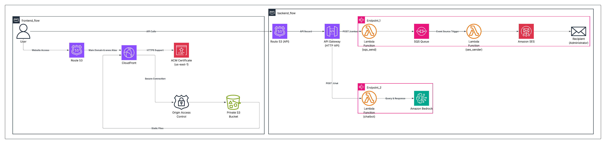

# CV-DevOps Project: A Fully Serverless CV

Welcome to my CV-DevOps project! This isn't just a regular CV. It's a fully functional, serverless web application deployed in the **AWS** cloud, managed 100% as **Infrastructure as Code (IaC)** using **Terraform** and CI/CD GitHub Actions.

This project was built to demonstrate practical skills in Cloud Engineering, DevOps, and automation, combining static site hosting with a dynamic, asynchronous API backend.

## System Architecture

The following diagram shows the complete application architecture, from the user's request all the way to the backend logic.



---

## Key Features

* **Static CV Site:** Fast, global content delivery using **AWS CloudFront** from a **private** **S3** bucket.
* **Interactive AI Chatbot:** An API endpoint (`POST /chat`) that synchronously communicates with **Amazon Bedrock** to answer questions.
* **Asynchronous Contact Form:** A reliable endpoint (`POST /contact`) based on the Producer-Consumer pattern. It accepts data, immediately pushes it to an **SQS** queue via the first Lambda, and then, triggered by SQS, sends an email in the background using a second **Lambda** and **SES**.
* **Security and Reliability:**
    * **HTTPS** enforcement at the CloudFront and API Gateway levels.
    * Private S3 bucket accessible only via CloudFront's **Origin Access Control (OAC)**.
    * Precisely defined IAM roles and policies for each Lambda function.
    * **Route 53** DNS for the root domain, `www` subdomain, and `api` subdomain.

---

## 💸 Estimated Costs & Free Tier

This architecture is designed to be extremely cost-effective by leveraging the **AWS Free Tier**. For a personal portfolio with low traffic, the monthly cost should be minimal.

* **Always Free ($0.00):**
    * **AWS Lambda:** 1 million free requests per month.
    * **Amazon SQS:** 1 million free requests per month.
    * **Amazon SES:** 62,000 outbound emails per month (when sent from Lambda).
    * **AWS CloudFront:** 1 TB of data transfer out and 10 million requests per month.
    * **Amazon S3:** 5 GB of standard storage.
    * **AWS ACM:** Public SSL/TLS certificates are free.

* **6-Month Free Tier:**
    * **API Gateway (HTTP API):** 1 million requests per month *for the first 12 months*. After that, the cost is still very low (+/- $1.00 per million requests).

* **Potential / Fixed Costs:**
    * **Route 53:** This is the main fixed cost. You pay **$0.50 per Hosted Zone per month**.
    * **Amazon Bedrock:** Bedrock has a separate, time-limited Free Tier for specific models. **This is the main component to monitor for potential costs** if your usage exceeds the free trial or if the trial period expires.

Expected monthly cost for this project is primarily the **$0.50 for the Route 53 Hosted Zone**, assuming traffic stays within the generous "Always Free" limits and Bedrock usage is minimal.

---

## Detailed Technical Breakdown

The architecture is divided into two main parts: Frontend (site hosting) and Backend (API logic).

### Frontend (Website)

* **S3 Bucket (`module.s3-bucket`):** Acts as a private repository for the `index.html` file.
* **CloudFront (`module.cloudfront`):** A global CDN that serves the site to users. It is the only public access point to the S3 resources, achieved via **Origin Access Control (OAC)**.
* **ACM (`module.acm_website`):** Provides the SSL certificate for the root domain, deployed in the **`us-east-1`** region.
* **Route 53 (`module.r53_root`, `module.r53_www`):** Directs traffic from the root domain and `www` subdomain to the CloudFront distribution.

### Backend (Serverless API)

The backend handles the application's dynamic functions (form and chatbot) and is available under a separate subdomain (e.g., `api.mycv.com`).

* **API Gateway (HTTP API) (`module.apigatewayv2`):** Creates the public API endpoint. It has CORS configured to allow requests from the frontend domain.
* **ACM & Route 53 (`module.acm_api`, `module.r53_api`):** A separate, regional SSL certificate (`eu-central-1`) and DNS record for the `api.` subdomain are mapped to the API Gateway (`module.api_gateway_mapping`).

The application supports two key backend data flows:

#### 1. Flow: Contact Form (`POST /contact`) - Asynchronous

This flow is intentionally asynchronous to ensure reliability and an immediate API response.

1.  A user sends a `POST /contact` request to the **API Gateway**.
2.  The API Gateway immediately invokes the **`sqs_send` Lambda** function.
3.  The `sqs_send` Lambda validates the data and immediately places it into the **SQS queue** (`module.sqs`).
4.  The API Gateway returns a `200` response to the frontend.
5.  A message in the SQS queue triggers (via `aws_lambda_event_source_mapping`) the second function: **`ses_sender` Lambda**.
6.  The `ses_sender` Lambda reads the message from the queue and sends an email using **SES**.

#### 2. Flow: Chatbot (`POST /chat`) - Synchronous

1.  A user sends a `POST /chat` request with the message content to the **API Gateway**.
2.  The API Gateway synchronously invokes the **`chatbot` Lambda** function.
3.  The `chatbot` Lambda connects to the **Amazon Bedrock** service, passes the query to the AI model, and waits for a response.
4.  The response from Bedrock is returned by the Lambda to the API Gateway and then back to the user on the frontend.

---

## Tech Stack

| Category | Technology | Purpose |
| :--- | :--- | :--- |
| **Infrastructure as Code** | **Terraform** | Defining and managing all AWS infrastructure. |
| **Hosting & Networking** | AWS S3, CloudFront, Route 53, ACM | Global static site delivery and DNS/SSL management. |
| **Business Logic** | **AWS Lambda** (Python) | Serverless backend functions (Producer, Consumer, Chatbot). |
| **API & Messaging** | AWS API Gateway, AWS SQS, AWS SES | API endpoint, asynchronous queue, email sending. |
| **Artificial Intelligence** | **Amazon Bedrock** | Powering the interactive chatbot. |

---

## CI/CD Pipeline (GitHub Actions)

In short, this pipeline automates **code quality control** and **secure infrastructure deployment**.

Its main tasks are:
1.  **Python Code Validation:** On every change (`push` or `pull request`), it automatically runs tests (`pytest`), checks style (`flake8`), types (`mypy`), and performs security scans (e.g., `bandit`, `safety`) for the Lambda function code.
2.  **Infrastructure Validation (Terraform):** It checks formatting (`fmt`), syntax validity (`validate`), and scans the Terraform code for security vulnerabilities (`tfsec`).
3.  **Planning and Deployment:**
    * For **Pull Requests** to the `main` branch, it generates a `terraform plan` and posts it as a comment for review before merging.
    * For a **Push/Merge to `main`**, it automatically takes the approved plan and runs `terraform apply`, deploying the changes to production (AWS).
4.  **Security and Notifications:** It uses secure **OIDC** authentication to connect to AWS (without access keys) and sends deployment status notifications to **Slack**.

---

## How to Deploy

The project is fully managed by Terraform.

1.  **Clone the Repository:**
    ```bash
    git clone [https://github.com/ItmanBuildsClouds/cv-devops](https://github.com/ItmanBuildsClouds/cv-devops)
    cd cv-devops
    ```

2.  **Configure Variables:**
    Define your values in `variables.tf`:
    * `domain_name`: Your domain registered in Route 53 (e.g., "ItmanBuildsClouds.website").
    * `recipient_mail`: The email address to receive messages from the form.
    * `project_name`: A unique name for the resources (e.g., "cv-devops").
    * Configure Credetials AWS with OIDC in .github/workflows/ci.yml for GitHubActions Role

3.  **Deploy with Terraform:**
    * Ensure you have your AWS credentials configured.
    * Initialize Terraform: `terraform init`
    * (Optional) See the planned changes: `terraform plan`
    * Apply the configuration: `terraform apply`

4.  **Post-Deployment:**
    * Terraform will automatically validate the ACM certificates using DNS records (if the domain is in Route 53).
    * The `index.html` file from the `/src/website/` directory will be automatically uploaded to S3 (`aws_s3_object.index`).
    * The site will be available at your domain after DNS propagation.
